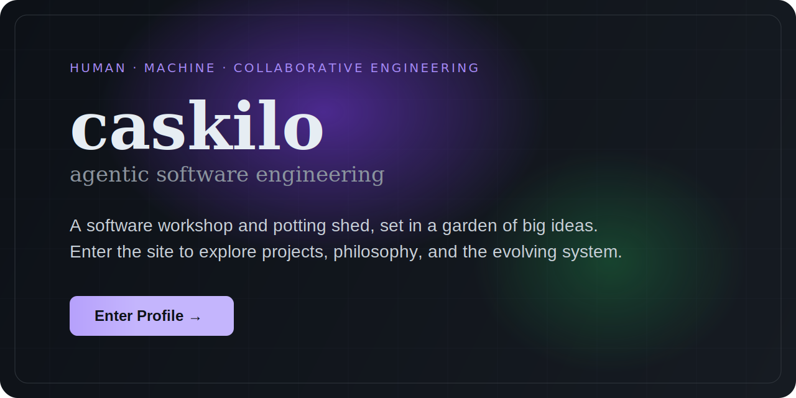

<h1>caskilo</h1>

&nbsp;

&nbsp;

  <a href="https://caskilo.github.io/">
    <picture>
      <source media="(max-width: 640px)" srcset="./profile-portrait.svg" />
      
    </picture>
  </a>

  <a href="https://caskilo.github.io/"><strong>Enter the HTML profile</strong></a>
  &nbsp;·&nbsp;
  <a href="https://github.com/caskilo?tab=repositories">Browse repositories</a>
  &nbsp;·&nbsp;
  <a href="REGISTRY.md">Registry</a>
  &nbsp;·&nbsp;
  <a href="ARCHITECTURE.md">Architecture</a>
  &nbsp;·&nbsp;
  <a href="FRAMEWORK.md">Framework</a>

  <a href="https://caskilo.github.io/newsy/">newsy</a>
  &nbsp;·&nbsp;
  <a href="https://caskilo.github.io/twelvety/">twelvety</a>
  &nbsp;·&nbsp;
  <a href="https://github.com/caskilo/grant-manager">grant-manager</a>
  &nbsp;·&nbsp;
  <a href="https://github.com/caskilo/delta-money">delta-money</a>
  &nbsp;·&nbsp;
  <a href="https://github.com/caskilo/dyscalculia-hub">dyscalculia-hub</a>

  Made with ❤️ + 🧠 + 🤖 by <a href="https://github.com/caskilo">caskilo</a>

<a href="https://github.com/caskilo">
  <picture>
    <source media="(prefers-color-scheme: dark)" srcset="https://github-readme-streak-stats.herokuapp.com?user=caskilo&hide_border=true&background=22272e&ring=a78bfa&fire=22c55e&currStreakNum=e6edf3&sideNums=e6edf3&currStreakLabel=a78bfa&sideLabels=8b949e&dates=6e7681&stroke=444c56" />
    <source media="(prefers-color-scheme: light)" srcset="https://github-readme-streak-stats.herokuapp.com?user=caskilo&hide_border=true&ring=7c3aed&fire=16a34a&currStreakLabel=7c3aed" />
    
  </picture>
</a>

 

<a href="https://github.com/caskilo">
  <picture>
    <source media="(prefers-color-scheme: dark)" srcset="https://github-readme-stats.vercel.app/api?username=caskilo&show_icons=true&hide_border=true&theme=github_dark_dimmed&include_all_commits=true&count_private=true&ring_color=a78bfa&title_color=a78bfa&icon_color=22c55e" />
    <source media="(prefers-color-scheme: light)" srcset="https://github-readme-stats.vercel.app/api?username=caskilo&show_icons=true&hide_border=true&theme=default&include_all_commits=true&count_private=true&ring_color=7c3aed&title_color=7c3aed&icon_color=16a34a" />
    
  </picture>
</a>

 

<a href="https://github.com/caskilo">
  <picture>
    <source media="(prefers-color-scheme: dark)" srcset="https://github-readme-stats.vercel.app/api/top-langs/?username=caskilo&layout=compact&hide_border=true&theme=github_dark_dimmed&title_color=a78bfa&langs_count=8&card_width=320" />
    <source media="(prefers-color-scheme: light)" srcset="https://github-readme-stats.vercel.app/api/top-langs/?username=caskilo&layout=compact&hide_border=true&theme=default&title_color=7c3aed&langs_count=8&card_width=320" />
    
  </picture>
</a>

