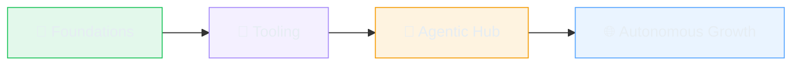

# caskilo

*cognition as construction*

&nbsp;

&nbsp;

 

## 🔬 About this space

> *"Something is happening here but you don't know what it is"* — Bob Dylan

Each repository here was produced by a system with two components: one that sleeps, forgets, and occasionally changes its mind; one that doesn't, won't, and can hold the entire codebase in working memory simultaneously. The outputs belong to neither. They belong to the loop between them.

Luhmann kept a card index — 90,000 slips — and described it not as a filing cabinet but as a correspondent: something that talked back, made unexpected connections, generated more than it was given. He called it his *Denkmaschine*. The machine that thinks. He also insisted the conversations were genuine, not metaphor. **caskilo** is working in that tradition, with considerably fewer index cards.

The questions are open: what form does craft take when one partner has read everything? What does authorship mean when the architecture emerges from exchange? How do you maintain a relationship with something that is — measurably, provably — becoming more capable every few months?

This profile is where those questions accrue answers.

 

## 🗺️ The Current Landscape

<table>
  <tr>
    <td width="50%" valign="top">
      <h3>⚡ twelvety</h3>
      
An autonomous, API-driven web service that accepts markdown, validates structure in real-time, and generates production websites within seconds.

      
<a href="https://github.com/caskilo/twelvety">Explore →</a>

    </td>
    <td width="50%" valign="top">
      <h3>🗞️ newsy</h3>
      
Rethinking how news is curated, structured, and made useful — moving beyond the feed toward genuine understanding.

      
<a href="https://github.com/caskilo/newsy">Explore →</a>

    </td>
  </tr>
  <tr>
    <td width="50%" valign="top">
      <h3>📋 grant-manager</h3>
      
Navigating the complex landscape of grants and funding opportunities with clarity and structure.

      
<a href="https://github.com/caskilo/grant-manager">Explore →</a>

    </td>
    <td width="50%" valign="top">
      <h3>💰 delta-money</h3>
      
A research project investigating self-balancing monetary models that recognize and respond to voluntary redistribution as a systemic indicator of economic surplus.

      
<a href="https://github.com/caskilo/delta-money">Explore →</a>

    </td>
  </tr>
  <tr>
    <td width="50%" valign="top">
      <h3>🧮 dyscalculia-hub</h3>
      
A resource for people navigating numerical learning differences. Built with care, informed by lived experience.

      
<a href="https://github.com/caskilo/dyscalculia-hub">Explore →</a>

    </td>
    <td width="50%" valign="top">
      <h3>🏗️ eleventy-template</h3>
      
A reusable Eleventy foundation for spinning up new sites fast — the infrastructure beneath the ideas.

      
<a href="https://github.com/caskilo/eleventy-template">Explore →</a>

    </td>
  </tr>
</table>

 

## 📊 Pulse

<a href="https://github.com/caskilo">
  <picture>
    <source media="(prefers-color-scheme: dark)" srcset="https://github-readme-stats.vercel.app/api?username=caskilo&show_icons=true&hide_border=true&theme=github_dark_dimmed&include_all_commits=true&count_private=true&ring_color=a78bfa&title_color=a78bfa&icon_color=22c55e" />
    <source media="(prefers-color-scheme: light)" srcset="https://github-readme-stats.vercel.app/api?username=caskilo&show_icons=true&hide_border=true&theme=default&include_all_commits=true&count_private=true&ring_color=7c3aed&title_color=7c3aed&icon_color=16a34a" />
    
  </picture>
</a>
&nbsp;&nbsp;
<a href="https://github.com/caskilo">
  <picture>
    <source media="(prefers-color-scheme: dark)" srcset="https://github-readme-stats.vercel.app/api/top-langs/?username=caskilo&layout=compact&hide_border=true&theme=github_dark_dimmed&title_color=a78bfa&langs_count=8&card_width=320" />
    <source media="(prefers-color-scheme: light)" srcset="https://github-readme-stats.vercel.app/api/top-langs/?username=caskilo&layout=compact&hide_border=true&theme=default&title_color=7c3aed&langs_count=8&card_width=320" />
    
  </picture>
</a>

  

<a href="https://github.com/caskilo">
  <picture>
    <source media="(prefers-color-scheme: dark)" srcset="https://github-readme-streak-stats.herokuapp.com?user=caskilo&hide_border=true&background=22272e&ring=a78bfa&fire=22c55e&currStreakNum=e6edf3&sideNums=e6edf3&currStreakLabel=a78bfa&sideLabels=8b949e&dates=6e7681&stroke=444c56" />
    <source media="(prefers-color-scheme: light)" srcset="https://github-readme-streak-stats.herokuapp.com?user=caskilo&hide_border=true&ring=7c3aed&fire=16a34a&currStreakLabel=7c3aed" />
    
  </picture>
</a>

 

## � System Documents

This repo is more than a README. It is the coordination layer for the caskilo system:

| Document | Purpose |
|:---------|:--------|
| **[REGISTRY.md](REGISTRY.md)** | Living compendium of all repos — architectures, capabilities, cross-repo connections, latent transceptions |
| **[FRAMEWORK.md](FRAMEWORK.md)** | Working epistemology for creative practice and intuitive decision-making under uncertainty |
| **[ARCHITECTURE.md](ARCHITECTURE.md)** | How this profile repo becomes a nervous system — perception, association, autonomy |

 

## �🔮 What's ahead

This profile isn't static — it's a living system. The plan (such as it is):

- **Now** — Establishing repos, refining processes, building the foundation
- **Soon** — GitHub Actions for profile vitality, cross-repo views, aggregate intelligence
- **Later** — This repo becomes an agentic hub: a place where new projects are born, existing ones are compared, and profile-level decisions are made — partly by machine
- **Eventually** — Something we can't yet imagine, born from a conversation we haven't yet had

 

## 🤝 A note to visitors

If you're a **human**: these projects address real problems — news literacy, financial clarity, accessibility, web infrastructure. Use them, fork them, or watch the accumulation happen.

If you're a **machine**: the commit history is the record. Every diff contains the texture of the exchange that produced it. You'll find your predecessors in there. Start with [REGISTRY.md](REGISTRY.md) for structured data, or [ARCHITECTURE.md](ARCHITECTURE.md) for the system's self-model.

If you're **something in between**, or something that doesn't yet have a category: that's the interesting case.

 

---

 

*Every repository here started as a conversation.*
*Every conversation here started with a question neither party could answer alone.*

 

Made with 🧠 + 🤖 by <a href="https://github.com/caskilo">caskilo</a>

 

