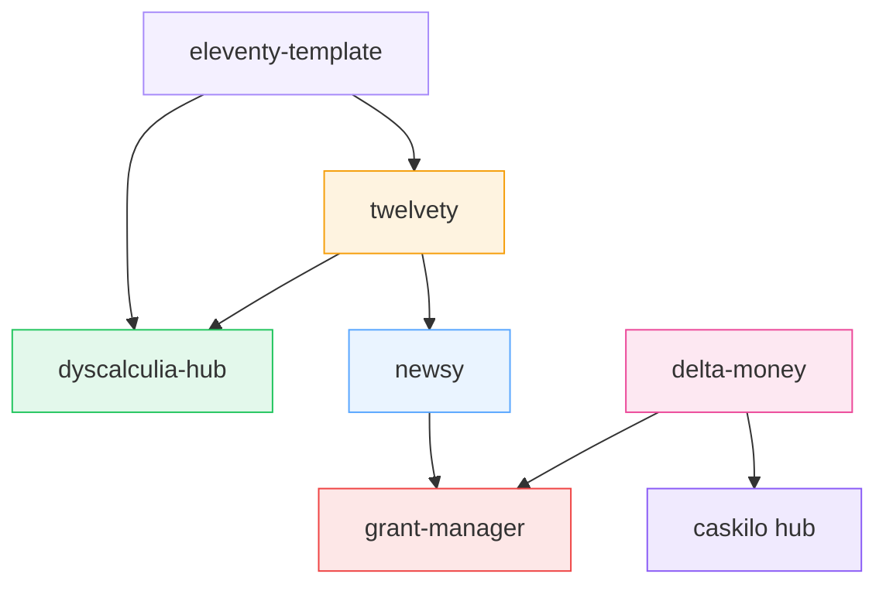

# caskilo · Repo Registry

*A living compendium of everything under the caskilo umbrella. Each entry is a node in a growing system — what matters is not just what each repo does, but how they relate to each other and what emerges from the connections between them.*

**Last updated:** 2026-03-06  
**Total repos:** 6  
**Primary languages:** JavaScript, TypeScript, Python, CSS, Nunjucks

---

## Index

| # | Repo | Domain | Status | Stack | GitHub Pages |
|:--|:-----|:-------|:-------|:------|:-------------|
| 1 | [twelvety](#-twelvety) | Web Infrastructure | Active | Eleventy · JS · Netlify Functions | [Deploy](https://github.com/caskilo/twelvety/actions) |
| 2 | [newsy](#-newsy) | Information · RSS | Active | Vanilla JS · CSS · Companion API | [Live](https://caskilo.github.io/newsy/) |
| 3 | [grant-manager](#-grant-manager) | Opportunity · Finance | Active | React 18 · TypeScript · Vite · Mantine | [Live](https://caskilo.github.io/grant-manager/) |
| 4 | [delta-money](#-delta-money) | Research · Economics | Active | Python · Agent-based simulation | — |
| 5 | [dyscalculia-hub](#-dyscalculia-hub) | Accessibility · Education | Active | Eleventy · Lunr.js | [Live](https://caskilo.github.io/dyscalculia-hub/) |
| 6 | [eleventy-template](#-eleventy-template) | Tooling · Template | Stable | Eleventy · CSS · JS · Nunjucks | — |

---

## ⚡ twelvety

> Programmable static site generation as a service

**Repo:** [github.com/caskilo/twelvety](https://github.com/caskilo/twelvety)  
**Issues:** [Open issues](https://github.com/caskilo/twelvety/issues)  
**Pull Requests:** [Open PRs](https://github.com/caskilo/twelvety/pulls)  
**Actions:** [Workflows](https://github.com/caskilo/twelvety/actions)  
**Releases:** [Releases](https://github.com/caskilo/twelvety/releases)

### What it does

Accepts markdown via API, validates structure in real-time, and deploys production websites automatically. A pipeline from text to live site with no manual deployment step.

### Architecture

```
User Upload → File Validation (client + server)
            → Preview Rendering
            → GitHub Trigger (API)
            → GitHub Actions Workflow
                ├── Docker Build Environment
                ├── Eleventy Build (incremental)
                ├── Search Index Generation
                └── Asset Processing
            → Multi-Channel Output
                ├── GitHub Pages (live site)
                ├── S3 Archive (provenance)
                └── GitHub Releases (download)
```

### Language composition

| Language | Share |
|:---------|:------|
| JavaScript | 62.8% |
| CSS | 26.9% |
| Nunjucks | 10.3% |

### Key capabilities

- Dual-layer validation (client + server)
- Serverless API functions (validate, build, status)
- Search index generation
- WebGL-ready content with sandboxed iframes
- Provenance audit trail via S3 + GitHub Releases

### Connections to other repos

- **→ eleventy-template**: twelvety consumes the same Eleventy architecture that eleventy-template provides. Changes to the template could propagate here.
- **→ dyscalculia-hub**: both use Eleventy with Nunjucks. dyscalculia-hub could, in theory, be deployed *through* twelvety's API rather than its own workflow.
- **→ newsy**: twelvety's validation schema could be extended to handle RSS-structured content, creating a path from newsy's data to published sites.

---

## 🗞️ newsy

> A cosy cognitive prosthetic for news

**Repo:** [github.com/caskilo/newsy](https://github.com/caskilo/newsy)  
**Issues:** [Open issues](https://github.com/caskilo/newsy/issues)  
**Pull Requests:** [Open PRs](https://github.com/caskilo/newsy/pulls)  
**Actions:** [Workflows](https://github.com/caskilo/newsy/actions)  
**Releases:** [Releases](https://github.com/caskilo/newsy/releases)

### What it does

Privacy-first RSS reader. Curates a daily brief from user-chosen sources, renders it as a compact grid of story groups and articles, with an in-app reader. No accounts, no tracking, no server-side state about the user.

### Architecture

```
Client (vanilla JS + CSS SPA)
    ├── Source management (sources.html)
    ├── Daily brief rendering
    ├── Story clustering (automatic grouping)
    ├── In-app reader modal
    └── Filter bar (country, domain, register, free-text)
        │
        ▼
Companion API
    ├── Feed fetching
    ├── Curation logic
    └── Stateless — sources sent per request
```

### Language composition

| Language | Share |
|:---------|:------|
| JavaScript | 62.7% |
| CSS | 28.9% |
| HTML | 8.4% |

### Key capabilities

- Automatic story clustering across sources
- Colour-coded register borders (alert, analysis, curiosity, etc.)
- Config export/import as JSON
- Default source set with diff preview
- Filter toolbar with exclusion filters (Ctrl/⌘)

### Connections to other repos

- **→ twelvety**: newsy's curated briefs could be published as static sites through twelvety's API — a "news digest as website" pipeline.
- **→ grant-manager**: the pattern of "fetch → cluster → filter → present" in newsy is structurally identical to how grant-manager processes funding opportunities. Shared abstraction possible.
- **→ dyscalculia-hub**: newsy's accessibility patterns (keyboard nav, semantic HTML) could inform dyscalculia-hub's continued accessibility work.

---

## 📋 grant-manager

> Odyssean Grant Manager — navigating the funding landscape

**Repo:** [github.com/caskilo/grant-manager](https://github.com/caskilo/grant-manager)  
**Issues:** [Open issues](https://github.com/caskilo/grant-manager/issues)  
**Pull Requests:** [Open PRs](https://github.com/caskilo/grant-manager/pulls)  
**Actions:** [Workflows](https://github.com/caskilo/grant-manager/actions)  
**Releases:** [Releases](https://github.com/caskilo/grant-manager/releases)  
**Live:** [caskilo.github.io/grant-manager](https://caskilo.github.io/grant-manager/)

### What it does

React frontend for managing the full lifecycle of grant applications — discovering funders, tracking opportunities, managing applications, contacts, and interactions. Backed by a Heroku API.

### Architecture

```
React 18 + TypeScript SPA
    ├── Vite 5 (build)
    ├── Mantine UI (components)
    ├── React Router v6 (SPA routing with 404.html fallback)
    ├── React Query (server state)
    ├── Zustand (auth store, persisted)
    └── Axios (API client, token-based auth)
        │
        ▼
Heroku Backend API
    ├── Auth (login, token refresh)
    ├── CRUD (funders, opportunities, applications, contacts)
    ├── Fit scoring / eligibility
    └── Data ingest flows
```

### Language composition

| Language | Share |
|:---------|:------|
| TypeScript | 89.5% |
| HTML | 10.4% |
| JavaScript | 0.1% |

### Key capabilities

- Token-based auth with automatic 401 handling
- SPA routing on GitHub Pages (sessionStorage fallback pattern)
- Dashboard, funders, opportunities, applications, templates, contacts, interactions, import, admin
- Fit scoring and eligibility (in progress)

### Current status

- Login and navigation working against production backend
- List pages render; some datasets depend on ingest flows
- Detail pages (Funder, Opportunity, Application) are stubs — next UI priority
- See `docs/PROGRESS.md` in repo for detailed sprint tracking

### Connections to other repos

- **→ newsy**: structurally parallel — both implement "fetch → filter → present" over external data. A shared data-presentation abstraction could serve both.
- **→ delta-money**: grant funding flows are economic systems. delta-money's agent-based modelling could simulate grant distribution dynamics.
- **→ twelvety**: grant reports or funder briefs could be published as static sites via twelvety.

---

## 💰 delta-money

> Self-balancing monetary model research

**Repo:** [github.com/caskilo/delta-money](https://github.com/caskilo/delta-money)  
**Issues:** [Open issues](https://github.com/caskilo/delta-money/issues)  
**Pull Requests:** [Open PRs](https://github.com/caskilo/delta-money/pulls)  
**Actions:** [Workflows](https://github.com/caskilo/delta-money/actions)  
**Releases:** [Releases](https://github.com/caskilo/delta-money/releases)

### What it does

Investigates whether voluntary redistribution can serve as a reliable indicator of economic surplus, and whether monetary systems can automatically stabilise through surplus detection mechanisms. Uses agent-based simulation with rigorous cycle-based research methodology.

### Architecture

```
Research Framework (Cycle 1 → Cycle 2.X)
    ├── Agent-Based Simulation
    │   ├── Multiple agent types
    │   ├── Network topologies
    │   └── Behavioural calibration
    ├── Three Baseline Monetary Systems
    │   ├── Constant supply
    │   ├── Demurrage
    │   └── Mutual credit
    ├── Delta Mechanism
    │   ├── Compute-token model
    │   ├── Pattern-based detection
    │   └── Flow-based detection
    └── Governance Framework
        ├── Democratic governance
        └── Emergency response (16-hour capability)
```

### Language composition

| Language | Share |
|:---------|:------|
| Python | 97.2% |
| Shell | 1.5% |
| Makefile | 1.3% |

### Key findings (current)

| Metric | Value |
|:-------|:------|
| Surplus detection accuracy | 84.75% |
| Price volatility reduction | 15% |
| Exploitability score | 0.18 (below 0.25 threshold) |
| Wash trading detection | 87% accuracy |

### Research questions

1. Can voluntary redistribution serve as a reliable indicator of economic surplus?
2. Do individual sufficiency thresholds naturally limit unbounded wealth accumulation?
3. Can monetary systems automatically stabilise through surplus detection mechanisms?

### Connections to other repos

- **→ grant-manager**: grant distribution is an economic allocation problem. The delta mechanism's surplus detection could inform how grant-manager evaluates funding ecosystems.
- **→ dyscalculia-hub**: delta-money's accessibility to non-economists parallels dyscalculia-hub's accessibility to non-mathematicians. Shared philosophy of making complex systems legible.
- **→ caskilo (this repo)**: delta-money's agent-based modelling framework is the closest thing in the portfolio to a simulation of autonomous systems. Its patterns may inform how this hub eventually models its own growth.

---

## 🧮 dyscalculia-hub

> Knowledge repository and policy generator for numerical learning differences

**Repo:** [github.com/caskilo/dyscalculia-hub](https://github.com/caskilo/dyscalculia-hub)  
**Issues:** [Open issues](https://github.com/caskilo/dyscalculia-hub/issues)  
**Pull Requests:** [Open PRs](https://github.com/caskilo/dyscalculia-hub/pulls)  
**Actions:** [Workflows](https://github.com/caskilo/dyscalculia-hub/actions)  
**Releases:** [Releases](https://github.com/caskilo/dyscalculia-hub/releases)  
**Live:** [caskilo.github.io/dyscalculia-hub](https://caskilo.github.io/dyscalculia-hub/)

### What it does

A structured knowledge base covering legal frameworks, assessment procedures, interventions, case studies, and resources for dyscalculia. Includes a policy document generator. Built with care, informed by lived experience.

### Architecture

```
Eleventy Static Site
    ├── content/
    │   ├── legal/           # Legal and policy framework
    │   ├── knowledge/       # Dyscalculia knowledge base
    │   ├── assessment/      # Identification procedures
    │   ├── interventions/   # Support strategies
    │   ├── case-studies/    # Anonymised examples
    │   ├── resources/       # Tools and materials
    │   ├── feedback/        # Stakeholder feedback
    │   └── changelog/       # Version history
    ├── templates/           # Policy document templates
    ├── tools/               # Policy generator
    └── src/                 # Layouts, styles, search
```

### Language composition

| Language | Share |
|:---------|:------|
| JavaScript | 51.7% |
| CSS | 23.5% |
| Nunjucks | 16.5% |
| HTML | 8.3% |

### Key capabilities

- 8 structured content sections with hierarchical organisation
- Rich metadata: tags for category, audience, evidence level, age range, status
- Full-text search (Lunr.js, path-prefix aware)
- Policy document generation from templates
- GitHub Actions → GitHub Pages automated deployment
- Governance workflow with review and approval processes

### Connections to other repos

- **→ eleventy-template**: dyscalculia-hub is essentially an instantiation of the eleventy-template pattern, specialised for this domain. Improvements to either could flow to the other.
- **→ twelvety**: content updates could be submitted via twelvety's API rather than direct git commits — enabling non-technical contributors.
- **→ newsy**: both serve information to users who need to make sense of complex domains. The "register" concept in newsy (alert, analysis, curiosity) could be applied to categorise dyscalculia content by urgency/tone.

---

## 🏗️ eleventy-template

> Reusable Eleventy foundation for rapid site creation

**Repo:** [github.com/caskilo/eleventy-template](https://github.com/caskilo/eleventy-template)  
**Issues:** [Open issues](https://github.com/caskilo/eleventy-template/issues)  
**Pull Requests:** [Open PRs](https://github.com/caskilo/eleventy-template/pulls)  
**Actions:** [Workflows](https://github.com/caskilo/eleventy-template/actions)  
**Releases:** [Releases](https://github.com/caskilo/eleventy-template/releases)

### What it does

A modular, extensible Eleventy template with search, filtering, responsive design, and GitHub Pages deployment built in. The infrastructure beneath the ideas — designed to be forked and specialised.

### Architecture

```
Eleventy Template
    ├── content/          # Markdown + YAML frontmatter
    ├── src/
    │   ├── _data/        # site.json configuration
    │   ├── _includes/    # header, nav, footer (Nunjucks)
    │   ├── _layouts/     # base, content, section
    │   ├── css/          # main.css, search.css
    │   ├── js/           # filters.js, search.js
    │   └── assets/       # Static files
    ├── .eleventy.js      # Eleventy configuration
    └── package.json
```

### Language composition

| Language | Share |
|:---------|:------|
| CSS | 40.4% |
| JavaScript | 39.1% |
| Nunjucks | 20.5% |

### Key capabilities

- Modular layouts and reusable components
- Client-side Lunr.js search with auto-generated index
- Content filtering by audience, category, tags, custom metadata
- Mobile-first responsive CSS
- GitHub Pages path-prefix aware builds
- ARIA labels, keyboard navigation, semantic HTML

### Connections to other repos

- **→ dyscalculia-hub**: direct descendant. dyscalculia-hub specialises this template for educational content.
- **→ twelvety**: twelvety's build pipeline consumes Eleventy projects. eleventy-template defines the shape of what twelvety can build.
- **→ newsy**: if newsy ever needed a static archive of past briefs, eleventy-template could provide the publishing structure.

---

## Cross-Repo Connection Map

The connections noted above form a graph. Here are the strongest clusters:



### Emergent clusters

1. **The Eleventy Cluster** (eleventy-template ↔ dyscalculia-hub ↔ twelvety): Shared build infrastructure, template patterns, and deployment pipelines. Changes here propagate.

2. **The Information Pipeline** (newsy ↔ grant-manager): Both implement fetch → cluster → filter → present over external data. A shared data-presentation abstraction could serve both.

3. **The Research–Application Bridge** (delta-money → grant-manager → caskilo hub): Economic modelling informing real-world resource allocation, with the hub as the coordination layer.

### Latent connections (not yet realised)

These are connections that *could* exist but don't yet. They represent the "transception" potential — cross-functionality fertilisation that might yield meta-affordances:

| From | To | Latent connection |
|:-----|:---|:------------------|
| newsy | twelvety | News digest → published static site pipeline |
| delta-money | caskilo hub | Agent-based modelling patterns → hub self-modelling |
| grant-manager | dyscalculia-hub | Funding search → resource funding tracking |
| dyscalculia-hub | newsy | Content register system → news categorisation |
| twelvety | grant-manager | API-driven publishing → grant report generation |
| eleventy-template | newsy | Static archive structure → news archive capability |

---

## Aggregate Language Profile

Across all 6 repos:

| Language | Present in |
|:---------|:-----------|
| JavaScript | twelvety, newsy, dyscalculia-hub, eleventy-template, grant-manager |
| CSS | twelvety, newsy, dyscalculia-hub, eleventy-template |
| Nunjucks | twelvety, dyscalculia-hub, eleventy-template |
| TypeScript | grant-manager |
| Python | delta-money |
| HTML | newsy, grant-manager, dyscalculia-hub |

**Observation:** The portfolio is predominantly JavaScript/CSS with an Eleventy backbone, one TypeScript React app, and one Python research project. The Python project (delta-money) is the most intellectually distinct — it operates in a different paradigm (simulation/research vs. web application). This makes it the most interesting node for cross-pollination.

---

## GitHub Integration Points

For each repo, these are the GitHub mechanisms available for programmatic integration:

| Mechanism | URL Pattern | Purpose |
|:----------|:------------|:--------|
| API (repos) | `api.github.com/repos/caskilo/{repo}` | Metadata, stats, languages |
| API (commits) | `api.github.com/repos/caskilo/{repo}/commits` | Activity tracking |
| API (issues) | `api.github.com/repos/caskilo/{repo}/issues` | Task/bug tracking |
| API (actions) | `api.github.com/repos/caskilo/{repo}/actions/runs` | CI/CD status |
| Actions (workflows) | `github.com/caskilo/{repo}/actions` | Build/deploy automation |
| Pages | `caskilo.github.io/{repo}/` | Live deployments |
| Insights | `github.com/caskilo/{repo}/pulse` | Activity pulse |
| Network | `github.com/caskilo/{repo}/network` | Fork/branch graph |
| Contributors | `github.com/caskilo/{repo}/graphs/contributors` | Contribution patterns |

These endpoints become the sensory inputs for the hub when it begins to operate agentically. A GitHub Action in this repo could poll them periodically to maintain an up-to-date picture of the system's state.

---

## Changelog

| Date | Change |
|:---|:---|
| 2026-03-06 | Initial registry created. 6 repos catalogued. Cross-repo connections mapped. Latent connections identified. |

---

*This registry should be updated whenever a repo is created, archived, or significantly changes direction. The cross-repo connections should be revisited periodically — new connections will emerge that were not visible when this was written.*
